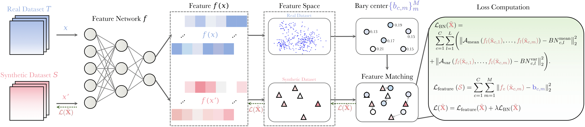
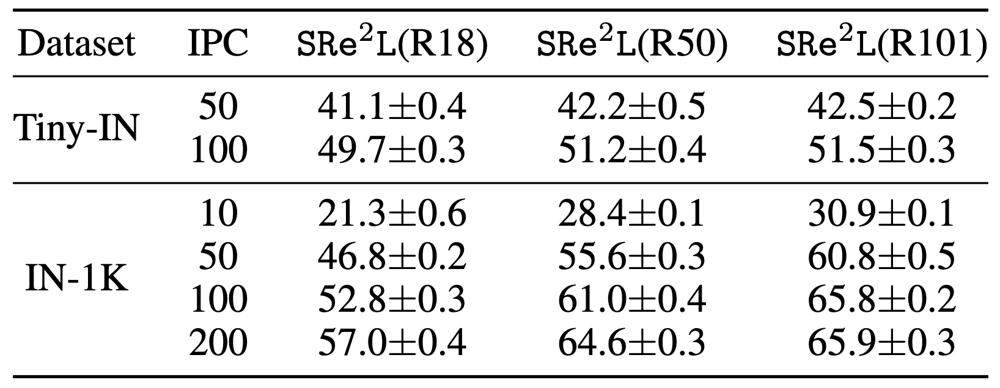

# Dataset Distillation with Feature Matching through the Wasserstein Metric

Official PyTorch implementation of paper:
>[__"Dataset Distillation with Feature Matching through the Wasserstein Metric"__](https://arxiv.org/abs/2311.18531)<br>
>Haoyang Liu, Yijiang Li, Tiancheng Xing, Vibhu Dalal, Luwei Li, Jingrui He, Haohan Wang<br>
>UIUC, UC San Diego, Nanjing University

[`[Project Page]`]()  [`[Paper]`](https://arxiv.org/abs/2311.18531)  [`[Code]`](https://github.com/Liu-Hy/WMDD)

***Abstract.***
> Dataset Distillation (DD) aims to generate a compact synthetic dataset that enables models to achieve performance comparable to training on the full large dataset, significantly reducing computational costs. Drawing from optimal transport theory, we introduce WMDD (Dataset Distillation with Wasserstein Metric-based Feature Matching), a straightforward yet powerful method that employs the Wasserstein metric to enhance distribution matching.
>
> We compute the Wasserstein barycenter of features from a pretrained classifier to capture essential characteristics of the original data distribution. By optimizing synthetic data to align with this barycenter in feature space and leveraging per-class BatchNorm statistics to preserve intra-class variations, WMDD maintains the efficiency of distribution matching approaches while achieving state-of-the-art results across various high-resolution datasets. Our extensive experiments demonstrate WMDD's effectiveness and adaptability, highlighting its potential for advancing machine learning applications at scale.

<div align=center>

</div>


## Distillation Animation

<div align=left>

</div>

******************************
Kindly wait a few seconds for the animation visualizations to load.
******************************

## Distilled ImageNet

<div align=left>

</div>

## Squeeze 

- For ImageNet-1K, we use the official PyTorch pre-trained models from [Torchvision Model Zoo](https://pytorch.org/vision/stable/models.html).

- For Tiny-ImageNet-200, we use official [Torchvision code](https://github.com/pytorch/vision/tree/main/references/classification) to train the model from scratch.

## Run all

Modify the Pytorch source code according to this [train/README.md](train/README.md)
```bash
bash run.sh -x 2 -y 1 -d imagenette -u 0 -c 10 -r /home/user/data/ -n -w -b 3.0
````

## Recover 

More details in [recover/README.md](recover/README.md).
```bash
cd recover
sh recover.sh
```

## Relabel 

More details in [relabel/README.md](relabel/README.md).
```bash
cd relabel
sh relabel.sh
```

## Train on Distilled Data

More details in [train/README.md](train/README.md).
```bash
cd train
sh train.sh
```

## Download

You can download distilled data and soft labels from https://zeyuanyin.github.io/projects/SRe2L/#Download.

## Results

Our Top-1 accuracy (%) under different IPC settings on Tiny-ImageNet and ImageNet-1K datasets:

<div align=center>

</div>


## Citation

If you find our code useful for your research, please cite our paper.

```
@article{liu2023dataset,
  title={Dataset distillation via the wasserstein metric},
  author={Liu, Haoyang and Li, Yijiang and Xing, Tiancheng and Dalal, Vibhu and Li, Luwei and He, Jingrui and Wang, Haohan},
  journal={arXiv preprint arXiv:2311.18531},
  year={2023}
}
```

